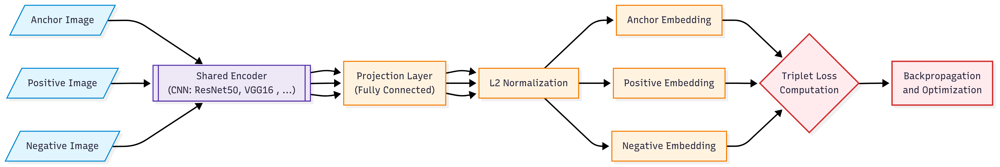

# Enhancing Logo Recognition and Similarity Search Through Synthetic Data Generation and Deep Learning Technique

## Chapter 1: Introduction
### 1.1 Research Objectives
## Chapter 2: Literature Review

## Chapter 3: Methodology
<!-- figures\methodology\data_preparation.png -->
<!-- figures\methodology\triplet_network_architecture.png -->
<!-- figures\methodology\retriever_architecture.png -->
<!-- figures\methodology\resnet_loss_curves.png -->
<!-- figures\methodology\efficientnet_loss_curves.png -->
<!-- figures\methodology\vgg_loss_curves.png -->
### 3.1 Dataset


### 3.2 Data Preparation

The data preparation stage constitutes the backbone of the proposed logo recognition and similarity retrieval pipeline. It is designed to transform raw multimodal inputs—synthetic logo images and their associated textual prompts—into structured, low-dimensional representations suitable for unsupervised clustering and deep metric learning. This stage ensures that both visual semantics and textual concepts are jointly modeled in a way that enables scalable training and retrieval.

Given the constraints of real-world logo datasets, including limited variability, labeling costs, and poor generalizability to unseen brand identities, this research employs a synthetically generated dataset comprising **1,777,584 logo images**, each accompanied by a **prompt** describing the logo’s visual style, theme, or concept. To leverage this rich dual-modality, we construct **multimodal embeddings** as follows:

Each image is processed using a frozen **ResNet50** model pretrained on ImageNet. The final fully connected classification layer is removed, and the output from the last convolutional block is flattened to obtain a **2048-dimensional** visual embedding. Simultaneously, the corresponding prompt text is embedded using the transformer-based **MiniLM model** (`all-MiniLM-L6-v2`), producing a **384-dimensional** semantic embedding that captures linguistic features relevant to logo design.

The visual and textual embeddings are then **concatenated** to yield a unified **2432-dimensional feature vector** for each logo. While this combined representation is expressive, its high dimensionality poses challenges for clustering due to the curse of dimensionality and computational overhead. To mitigate this, we apply **UMAP (Uniform Manifold Approximation and Projection)** for nonlinear dimensionality reduction, projecting the embeddings into a **600-dimensional space**. UMAP is configured with cosine similarity as the distance metric and a minimum distance of zero to preserve fine-grained local structure in the embedding space.

Following dimensionality reduction, the dataset is subjected to **unsupervised clustering using HDBSCAN**, a hierarchical density-based clustering algorithm that does not require a predefined number of clusters. HDBSCAN identifies dense regions in the embedding space as clusters and marks low-density points as outliers (with label = -1). To ensure that all logos are eventually assigned to a category, we perform **a second clustering pass** specifically on the outlier samples using a new HDBSCAN model. The cluster IDs from this secondary pass are offset to prevent overlap with those from the primary clustering phase.

The result of this two-step clustering pipeline is a set of **209,310 distinct visual categories**, each containing at least two images. These categories serve as **weak labels** that guide the construction of triplets in the subsequent metric learning stage. This form of pseudo-labeling ensures that the model can learn similarity relationships without relying on manually annotated classes, allowing the system to scale across millions of logos with minimal supervision.

Once clustering is complete, the dataset is **partitioned into training, validation and test subsets** using a stratified strategy that preserves category integrity. For each visual category produced by HDBSCAN, all associated samples are considered. If the category contains fewer than two images, it is excluded from training to avoid degenerate triplets. For the remaining categories, the samples are randomly shuffled, and approximately 70% are allocated to the training set, while up to 10% are reserved for validation and the remaining 20% for testing—provided that at least two samples remain in the training portion to allow valid anchor–positive pairs. This procedure ensures that every triplet sampled during training reflects meaningful intra-class and inter-class relationships.

The final result of the data preparation stage is a clean, structured, and semantically consistent dataset consisting of  **127,9860 training samples** , **142207 validation samples** and **355,517 test samples**, each labeled by a pseudo-category derived from unsupervised clustering. This foundation enables high-quality metric learning in the training stage and facilitates robust performance evaluation on previously unseen logos.


## 3.3 Triplet Network Architecture
```python
from gc import freeze
class BaseBackbone(nn.Module, ABC):
    """
    Abstract base class for all CNN backbone models.
    Subclasses must implement the `forward` method.
    """

    def __init__(self, output_dim: int):
        """
        Args:
            output_dim (int): Dimension of the feature vector output by the backbone
        """
        super().__init__()
        self.output_dim = output_dim
        self.transforms = None

    def set_requires_grad(self, requires_grad: bool):
        """
        Set the requires_grad attribute of all parameters in the model.

        Args:
            requires_grad (bool): Whether to set the requires_grad attribute to True or False
        """
        for param in self.parameters():
            param.requires_grad = requires_grad

    def forward(self, x):
        """
        Args:
            x (torch.Tensor): Input tensor of shape (batch_size, num_channels, height, width)

        Returns:
            torch.Tensor: Output tensor of shape (batch_size, output_dim)
        """
        raise NotImplementedError

class ResNet50Backbone(BaseBackbone):
    """
    ResNet50 backbone with optional layer freezing.
    """
    def __init__(self, output_dim=2048, weights=ResNet50_Weights.IMAGENET1K_V2, freeze=True):
        super().__init__(output_dim)
        self.transforms = weights.transforms()
        self.model = models.resnet50(weights=weights)
        self.model.fc = torch.nn.Identity()
        if freeze:
            self.set_requires_grad(False)


    def forward(self, x):
        """
        Args:
            x (torch.Tensor): Input tensor of shape (batch_size, num_channels, height, width)

        Returns:
            torch.Tensor: Output tensor of shape (batch_size, output_dim)
        """
        x = self.transforms(x)
        x = self.model(x)
        x = x.view(x.size(0), -1)
        return x

class EfficientNetBackbone(BaseBackbone):
    """
    EfficientNet backbone with optional layer freezing.
    """
    def __init__(self, output_dim=1280, weights=EfficientNet_B0_Weights.IMAGENET1K_V1, freeze=True):
        super().__init__(output_dim)
        self.transforms = weights.transforms()
        self.model = models.efficientnet_b0(weights=weights)
        self.model.classifier = torch.nn.Identity()
        if freeze:
            self.set_requires_grad(False)


    def forward(self, x):
        """
        Args:
            x (torch.Tensor): Input tensor of shape (batch_size, num_channels, height, width)

        Returns:
            torch.Tensor: Output tensor of shape (batch_size, output_dim)
        """
        x = self.transforms(x)
        x = self.model(x)
        x = x.view(x.size(0), -1)
        return x


class VGG16Backbone(BaseBackbone):
    """
    VGG16 backbone with optional layer freezing.
    """
    def __init__(self, output_dim=4096, weights=VGG16_Weights.IMAGENET1K_V1, freeze=True):
        super().__init__(output_dim)
        self.transforms = weights.transforms()
        self.model = models.vgg16(weights=weights)
        self.model.classifier = torch.nn.Sequential(*list(self.model.classifier.children())[:-1])

        if freeze:
            self.set_requires_grad(False)


    def forward(self, x):
        """
        Args:
            x (torch.Tensor): Input tensor of shape (batch_size, num_channels, height, width)

        Returns:
            torch.Tensor: Output tensor of shape (batch_size, output_dim)
        """
        x = self.transforms(x)
        x = self.model(x)
        return x


class TripletLossTrainer(Trainer):
    """
    Custom HuggingFace Trainer for Triplet Loss.
    """

    def __init__(self, *args, margin: float = 1.0, reduction: str = "mean", **kwargs):
        super().__init__(*args, **kwargs)
        self.triplet_loss_fn = nn.TripletMarginLoss(margin=margin, p=2, reduction=reduction)

    def compute_loss(self, model, inputs, return_outputs=False, **kwargs):
        outputs = model(**inputs)
        loss = self.triplet_loss_fn(outputs["anchor"], outputs["positive"], outputs["negative"])
        return (loss, outputs) if return_outputs else loss

    def prediction_step(self, model, inputs, prediction_loss_only=False, ignore_keys=None):
        inputs = self._prepare_inputs(inputs)
        with torch.no_grad():
            outputs = model(**inputs)
            loss = self.triplet_loss_fn(outputs["anchor"], outputs["positive"], outputs["negative"])

        return (loss, None, None) if prediction_loss_only else (loss, outputs, None)


class FeedForwardBlock(nn.Sequential):
    """
    Custom feed-forward block (Dense -> BN -> ReLU -> Dropout).
    """
    def __init__(self, in_features: int, out_features: int, dropout: float):
        super().__init__(
            nn.Linear(in_features, out_features),
            nn.BatchNorm1d(out_features),
            nn.ReLU(),
            nn.Dropout(dropout)
        )


class TripletNet(nn.Module, PyTorchModelHubMixin):
    """
    TripletNet with a CNN backbone and optional feed-forward projection blocks.

    Args:
        backbone (nn.Module): A frozen or trainable CNN backbone with .encode()
        embedding_dim (int): Final dimensionality of the embedding space
        ff_block_units (List[int]): List of hidden units in feed-forward blocks
        dropout (float): Dropout rate
    """

    _BACKBONES = {
        "Resnet50": ResNet50Backbone,
        }


    def __init__(self,
                 config: dict
                 ):
        super().__init__()
        self.config = config
        if config["backbone_type"] not in self._BACKBONES:
            raise ValueError(f"Unknown backbone type: {self.config['backbone_type']}")
        self.backbone = self._BACKBONES[self.config['backbone_type']]()


        # Construct projection head
        layers = []
        input_dim = self.backbone.output_dim
        for units in self.config['ff_block_units']:
            layers.append(FeedForwardBlock(input_dim, units, self.config['dropout']))
            input_dim = units

        layers.append(nn.Linear(input_dim, self.config['embedding_dim']))
        self.projection_head = nn.Sequential(*layers)
        self.config = PretrainedConfig(**self.config)


    def encode(self, x: torch.Tensor) -> torch.Tensor:
        features = self.backbone(x)
        projection = self.projection_head(features)
        return F.normalize(projection, p=2, dim=1)

    def forward(self,
                anchor: torch.Tensor,
                positive: torch.Tensor,
                negative: torch.Tensor) -> dict:
        return {
            "anchor": self.encode(anchor),
            "positive": self.encode(positive),
            "negative": self.encode(negative)
        }

    def get_transforms(self):
        return self.backbone.transforms

```



## 3.4 Training Procedure
```python
import os
from pathlib import Path
import torch

class Config:
    """
    Configuration class for the Triplet Network training project.
    """

    # ========== Project Name & Paths ==========
    project_name = "logo_recognition_similarity_search_project"
    base_dir = Path("/content/drive/MyDrive") / project_name
    output_dir = base_dir / "output_last"
    cache_dir = base_dir / "cache"

    os.makedirs(output_dir, exist_ok=True)
    os.makedirs(cache_dir, exist_ok=True)

    # ========== Dataset Settings ==========
    dataset_path = "mlproject5606/Original-Logo-Recognition-Category-Split-Dataset"
    dataset_cache_dir = cache_dir / dataset_path.split("/")[-1]
    category_indices_cache_dir = cache_dir / "Category-Indices-last"
    train_category_indices_path = category_indices_cache_dir / "category_train_indices.json"
    test_category_indices_path = category_indices_cache_dir / "category_test_indices.json"
    val_category_indices_path = category_indices_cache_dir / "category_val_indices.json"

    # ========== Model Settings ==========
    backbone_type = "Resnet50"        # "Resnet50"
    output_dim = 512                  # Output dimension of backbone CNN
    embedding_dim = 256               # Final embedding dimension (after projection head)
    ff_block_units = [512, 256]       # Units in feed-forward projection head
    dropout = 0.3                     # Dropout rate in projection head
    freeze_backbone = True            # Whether to freeze CNN weights

    # ========== Training Runtime Settings ==========
    device = "cuda" if torch.cuda.is_available() else "cpu"
    seed = 42
    batch_size = 1024
    num_workers = 4

    # ========== Hugging Face TrainingArguments ==========
    num_train_epochs = 10
    learning_rate = 1e-4
    weight_decay = 0.01
    logging_steps = 5
    eval_strategy = "epoch"             # Options: "no", "steps", "epoch"
    save_strategy = "epoch"             # Options: "no", "steps", "epoch"
    save_total_limit = 2                # Keep only last N checkpoints
    metric_for_best_model = "eval_loss"
    greater_is_better = False
    report_to = "tensorboard"           # Enables TensorBoard logging
    model_id = f'mlproject5606/Logo-Recognition-{backbone_type}-TripletLoss'
    model_output_dir = output_dir / f'{model_id.split("/")[1]}'
    model_evaluation_dir = model_output_dir / "evaluation"
    os.makedirs(model_evaluation_dir, exist_ok=True)


# Create configuration object
cfg = Config()

import json
import random
import torch
import datasets


class TripletDataset(torch.utils.data.Dataset):
    """
    Custom dataset class for triplet network.
    """

    def __init__(self,
                 ds:datasets.Dataset,
                 category_indices_path:str,
                 seed:int=None,
                 ):
        """
        Initialize the TripletDataset.
        """
        print(f"[INFO] Initializing Triplet Dataset")

        self.ds = ds
        self.seed = seed
        self.rng = random.Random() if seed is None else random.Random(seed)
        self.category_indices_path = category_indices_path

        print(f"[INFO] Loading category indices from: {self.category_indices_path}")
        self.category_indices = self._load_category_indices(self.category_indices_path)
        self.categories = sorted(list(self.category_indices.keys()))

        print(f"[INFO] Triplet Dataset Initialized")


    def _load_category_indices(self, category_indices_path):
        """
        Load category indices from a JSON file.
        """
        with open(category_indices_path, "r") as f:
            category_indices = json.load(f)
        category_indices = {int(k): v for k, v in category_indices.items()}
        return category_indices

    def __len__(self):
        """
        Return the number of samples in the dataset.
        """
        return len(self.ds)


    def _get_positive(self, category, anchor_idx=None):
        """
        Get a positive item for the given anchor index and category.
        """
        positive_indices = self.category_indices[category]
        if len(positive_indices)<2:
            positive_idx = positive_indices[0]

        elif anchor_idx is None:
            positive_idx = self.rng.choice(positive_indices)

        else:
            positive_idx = anchor_idx
            while positive_idx==anchor_idx:
                positive_idx = self.rng.choice(positive_indices)

        return self.ds[positive_idx]


    def _get_negative(self, category):
        """
        Get a negative item for the given anchor category.
        """
        negative_category = category
        while negative_category==category:
            negative_category = self.rng.choice(self.categories)

        negative_indices = self.category_indices[negative_category]
        negative_idx = self.rng.choice(negative_indices)
        return self.ds[negative_idx]


    def __getitem__(self, idx):
        """
        Get a triplet sample from the dataset.
        """
        anchor_idx = idx
        anchor = self.ds[anchor_idx]
        category = int(anchor["category"])

        positive = self._get_positive(category=category,
                                      anchor_idx=anchor_idx
                                      )


        negative = self._get_negative(category=category)


        return anchor , positive , negative

    @staticmethod
    def display_sample(sample):
        """
        Display the anchor, positive, and negative images.
        """
        images = []
        for i in range(len(sample)):
            image = sample[i]["image"]
            if isinstance(image, Image.Image):
                image = np.array(image)
            elif isinstance(image, torch.Tensor):
                image = image.permute(1, 2, 0).numpy()
            images.append(image)

        fig, axes = plt.subplots(1, 3, figsize=(10, 5))
        axes[0].imshow(images[0])
        axes[0].set_title(f"Anchor cat({sample[0]['category']})")

        axes[1].imshow(images[1])
        axes[1].set_title(f"Positive cat({sample[1]['category']})")

        axes[2].imshow(images[2])
        axes[2].set_title(f"Negative cat({sample[2]['category']})")

        for ax in axes:
            ax.axis("off")
        plt.show()

    @staticmethod
    def collate_fn(batch):
        """
        Collate function to process triplet batch for HuggingFace Trainer.

        Args:
            batch: List of (anchor_dict, positive_dict, negative_dict)

        Returns:
            Dict with keys 'anchor', 'positive', 'negative', each containing image batch tensor
        """
        anchors, positives, negatives = zip(*batch)

        anchor_images = torch.stack([item["image"].float()/255.0 for item in anchors])
        positive_images = torch.stack([item["image"].float()/255.0 for item in positives])
        negative_images = torch.stack([item["image"].float()/255.0 for item in negatives])

        return {
            "anchor": anchor_images,
            "positive": positive_images,
            "negative": negative_images
        }


train_dataset = TripletDataset(ds=ds["train"],
                               category_indices_path=cfg.train_category_indices_path,
                               seed=None
                               )


val_dataset = TripletDataset(ds=ds["validation"],
                             category_indices_path=cfg.val_category_indices_path,
                             seed=None
                             )


config = {
"backbone_type":cfg.backbone_type,
"embedding_dim":cfg.embedding_dim,
"ff_block_units":cfg.ff_block_units,
 "dropout": cfg.dropout
 }

model =TripletNet(config)
model.to(cfg.device)

training_args = TrainingArguments(
    output_dir=str(cfg.model_output_dir / "checkpoints"),
    logging_dir=str(cfg.model_output_dir / "logs"),
    per_device_train_batch_size=cfg.batch_size,
    per_device_eval_batch_size=cfg.batch_size,
    num_train_epochs=cfg.num_train_epochs,
    learning_rate=cfg.learning_rate,
    weight_decay=cfg.weight_decay,
    logging_steps=cfg.logging_steps,
    eval_strategy=cfg.eval_strategy,
    save_strategy=cfg.save_strategy,
    save_total_limit=cfg.save_total_limit,
    load_best_model_at_end=True,
    metric_for_best_model="eval_loss",
    greater_is_better=False,
    report_to=cfg.report_to
)

trainer = TripletLossTrainer(
    model=model,
    args=training_args,
    train_dataset=train_dataset,
    eval_dataset=val_dataset,
    margin=1.0,
    data_collator=TripletDataset.collate_fn,
)

%load_ext tensorboard
%tensorboard --logdir={cfg.model_output_dir}/logs

trainer.train()

model = TripletNet.from_pretrained(trainer.state.best_model_checkpoint,config=config)
model.save_pretrained(
    save_directory = cfg.model_output_dir / "final_model",
    repo_id = cfg.model_id,
    push_to_hub = True,
    token = userdata.get('HF_TOKEN')
)


from tensorboard.backend.event_processing import event_accumulator
import matplotlib.pyplot as plt
import os

event_file = max((cfg.model_output_dir / "logs").glob("events.*"), key=os.path.getmtime)
ea = event_accumulator.EventAccumulator(str(event_file))
ea.Reload()

tags = ["train/loss", "eval/loss"]
titles = ["Train Loss", "Validation Loss"]
color = "#1f77b4"

fig, axes = plt.subplots(1, 2, figsize=(14, 4.5))
axes = axes.flatten()
for i, tag in enumerate(tags):
    if tag in ea.Tags()["scalars"]:
        data = ea.Scalars(tag)
        steps = [e.step for e in data]
        values = [e.value for e in data]
        axes[i].plot(steps, values, color=color, linewidth=2)
        axes[i].set_title(titles[i], fontsize=14)
        axes[i].set_xlabel("Step", fontsize=12)
        axes[i].set_ylabel("Loss", fontsize=12)
        axes[i].grid(True, linestyle="--", alpha=0.6)

fig.suptitle(f"{cfg.backbone_type} TripletNet - Loss Curves", fontsize=16)
plt.tight_layout(rect=[0, 0, 1, 0.95])
plt.savefig(f"{cfg.model_evaluation_dir}/Loss_curves.png", dpi=300)
plt.show()

model=TripletNet.from_pretrained(cfg.model_id)
model.eval()
model.to(cfg.device)

torch.set_grad_enabled(False)

for split in ["train","validation","test"]:

    embedding_ds = ds[split].map(lambda batch: {"embedding":model.encode(batch['image'].to(cfg.device)).cpu().detach()},
                                 batched=True,
                                 batch_size=cfg.batch_size,
                                 desc=f"Generating embeddings for {split}"
                                 )

    embedding_ds.push_to_hub(f"{cfg.backbone_type}-TripletLoss-Embedding-Dataset",
                             split = split,
                             private = True,
                             token = userdata.get('HF_TOKEN')
                             )


```

### 3.5 Evaluation Metrics
```python

import os
from pathlib import Path
import torch

class Config:
    """
    Configuration class for the Triplet Network training project.
    """

    # ========== Project Name & Paths ==========
    project_name = "logo_recognition_similarity_search_project"
    base_dir = Path("/content/drive/MyDrive") / project_name
    output_dir = base_dir / "output_last"
    cache_dir = base_dir / "cache"

    # ========== Model Settings ==========
    backbone_type = "Resnet50"     # Options: "Resnet50", "Vgg16", "Efficientnet"
    model_id = f'mlproject5606/Logo-Recognition-{backbone_type}-TripletLoss'
    model_output_dir = output_dir / f'{model_id.split("/")[1]}'
    model_evaluation_dir = model_output_dir / "evaluation"


    # ========== Dataset Settings ==========
    dataset_path = f"mlproject5606/{backbone_type}-TripletLoss-Embedding-Dataset"
    dataset_cache_dir = cache_dir / dataset_path.split("/")[-1]

    # ========== Runtime Settings ==========
    device = "cuda" if torch.cuda.is_available() else "cpu"
    seed = 42
    batch_size = 512
    num_workers = 4

    # ========== Evaluation parameters ==========
    top_ks = [1, 5, 10]
    faiss_index_column = "embedding"

    os.makedirs(output_dir, exist_ok=True)
    os.makedirs(cache_dir, exist_ok=True)
    os.makedirs(model_evaluation_dir, exist_ok=True)


# Create configuration object
cfg = Config()


def load_dataset_with_embeddings(dataset_path, cache_dir=None):
    ds = datasets.load_dataset(path = dataset_path,cache_dir=cache_dir)
    ds_train = ds['train'].with_format("numpy")
    ds_test = ds['test'].with_format("numpy")
    return ds_train, ds_test

import torch
from torchmetrics.retrieval import (
    RetrievalPrecision,
    RetrievalRecall,
)

def evaluate_model_with_faiss(
    model_name,
    ds_train,
    ds_test,
    embedding_column="embedding",
    label_column="category",
    top_ks=[1, 5, 10],
    batch_size=100,
    save_csv_path=None
):
    max_k = max(top_ks)
    all_preds = []
    all_targets = []
    all_indexes = []
    ds_train = ds_train.add_faiss_index(column=embedding_column)

    def compute_metrics_batch(batch, indices):
        queries = batch[embedding_column]
        true_labels = batch[label_column]

        scores, retrieved = ds_train.get_nearest_examples_batch(
            embedding_column, queries=queries, k=max_k
        )

        preds, targets, query_ids = [], [], []
        for i, (score_list, retrieved_batch) in enumerate(zip(scores, retrieved)):
            qid = indices[i]
            retrieved_labels = retrieved_batch[label_column]
            for s, lbl in zip(score_list, retrieved_labels):
                preds.append(s)
                targets.append(1 if lbl == true_labels[i] else 0)
                query_ids.append(qid)

        return {
            "preds": preds,
            "targets": targets,
            "indexes": query_ids
        }

    mapped = ds_test.map(
        compute_metrics_batch,
        with_indices=True,
        batched=True,
        batch_size=batch_size,
        num_proc=4,
        desc=f"[{model_name}] Evaluating",
        remove_columns=ds_test.column_names,
    )

    preds_tensor = torch.tensor(mapped["preds"], dtype=torch.float32)
    targets_tensor = torch.tensor(mapped["targets"], dtype=torch.int)
    indexes_tensor = torch.tensor(mapped["indexes"], dtype=torch.long)

    results = []
    for k in top_ks:
        p = RetrievalPrecision(top_k=k)(preds_tensor,
                                        targets_tensor,
                                        indexes_tensor
                                        ).item()

        r = RetrievalRecall(top_k=k)(preds_tensor,
                                    targets_tensor,
                                    indexes_tensor
                                    ).item()

        f1 = 2 * (p * r) / (p + r) if (p + r) > 0 else 0

        results.append({
            "Model": model_name,
            "Top-K": k,
            "Precision@K": p,
            "Recall@K": r,
            "F1@K": f1,
        })

    df = pd.DataFrame(results)
    if save_csv_path:
        df.to_csv(save_csv_path, index=False)
        mapped.save_to_disk(f"{str(save_csv_path).split('.')[0]}_mapped")

    return df
save_csv_resnet_path = cfg.output_dir/"Logo-Recognition-Resnet50-TripletLoss/evaluation/evaluation_metrics.csv"
ds_train_resnet, ds_test_resnet = load_dataset_with_embeddings("mlproject5606/Resnet50-TripletLoss-Embedding-Dataset")


results_resnet = evaluate_model_with_faiss(model_name="Resnet50",
                                           ds_train=ds_train_resnet,
                                           ds_test=ds_test_resnet,
                                           embedding_column=cfg.faiss_index_column,
                                           label_column="category",
                                           top_ks=cfg.top_ks,
                                           batch_size=cfg.batch_size,
                                           save_csv_path=save_csv_resnet_path
                                           )
save_csv_vgg_path = cfg.output_dir/"Logo-Recognition-Vgg16-TripletLoss/evaluation/evaluation_metrics.csv"
ds_train_vgg, ds_test_vgg = load_dataset_with_embeddings("mlproject5606/Vgg16-TripletLoss-Embedding-Dataset")

results_vgg = evaluate_model_with_faiss(model_name="VGG16",
                                        ds_train=ds_train_vgg,
                                        ds_test=ds_test_vgg,
                                        embedding_column=cfg.faiss_index_column,
                                        label_column="category",
                                        top_ks=cfg.top_ks,
                                        batch_size=cfg.batch_size,
                                        save_csv_path=save_csv_vgg_path
                                        )
save_csv_eff_path = cfg.output_dir/"Logo-Recognition-Efficientnet-TripletLoss/evaluation/evaluation_metrics.csv"
ds_train_eff, ds_test_eff = load_dataset_with_embeddings("mlproject5606/Efficientnet-TripletLoss-Embedding-Dataset")
results_eff = evaluate_model_with_faiss(model_name="EfficientNet",
                                        ds_train=ds_train_eff,
                                        ds_test=ds_test_eff,
                                        embedding_column=cfg.faiss_index_column,
                                        label_column="category",
                                        top_ks=cfg.top_ks,
                                        batch_size=cfg.batch_size,
                                        save_csv_path=save_csv_eff_path
)

save_csv_resnet_path = cfg.output_dir/"Logo-Recognition-Resnet50-TripletLoss/evaluation/evaluation_metrics.csv"
save_csv_vgg_path = cfg.output_dir/"Logo-Recognition-Vgg16-TripletLoss/evaluation/evaluation_metrics.csv"
save_csv_eff_path = cfg.output_dir/"Logo-Recognition-Efficientnet-TripletLoss/evaluation/evaluation_metrics.csv"

results_resnet = pd.read_csv(save_csv_resnet_path)
results_vgg = pd.read_csv(save_csv_vgg_path)
results_eff = pd.read_csv(save_csv_eff_path)

df_all = pd.concat([results_resnet, results_vgg, results_eff], ignore_index=True)
df_all.to_csv(cfg.output_dir/"evaluation_results.csv", index=False)
df_all


```
## Chapter 4: Results and Discussion
Model	Top-K	Precision@K	Recall@K	F1@K
0	Resnet50	1	0.182709	0.046168	0.073710
1	Resnet50	5	0.184414	0.234355	0.206407
2	Resnet50	10	0.187246	0.484652	0.270128
3	VGG16	1	0.180951	0.045196	0.072327
4	VGG16	5	0.181212	0.226583	0.201373
5	VGG16	10	0.183161	0.464147	0.262668
6	EfficientNet	1	0.180987	0.045288	0.072447
7	EfficientNet	5	0.181097	0.226684	0.201343
8	EfficientNet	10	0.182856	0.462976	0.262167

## Chapter 5: Conclusion and Future Perspective