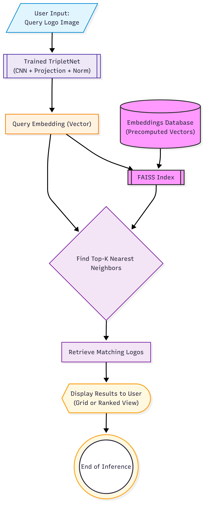

# Logo Similarity Retrieval via Synthetic Data and Deep Metric Learning

This project presents a scalable, weakly-supervised pipeline for **logo recognition** and **visual similarity search**. The system is designed to handle large-scale, unlabeled logo datasets by leveraging **synthetic data generation**, **multimodal embeddings**, and **deep metric learning** using a **Triplet Network**.

## 🧠 Overview

The core idea is to learn an embedding space where similar logos are projected close to each other, enabling high-performance retrieval even for previously unseen logos.

The pipeline consists of the following major stages:

1. **Synthetic Dataset Creation:**  
   Over 1.7 million logo images are generated along with text prompts describing their style and concept.

2. **Multimodal Embedding Construction:**  
   Visual features are extracted via a frozen ResNet50; text prompts are embedded using MiniLM. Both are concatenated to form a 2432D vector.

3. **Clustering:**  
   UMAP reduces the embedding to 600D, followed by HDBSCAN clustering to derive over 209,000 pseudo-categories as weak labels.

4. **Triplet Network Training:**  
   Triplets are sampled using pseudo-labels. The model is trained to learn a 256D normalized embedding via Triplet Loss.

5. **Inference and Retrieval:**  
   Embeddings from the trained model are queried against a FAISS index to retrieve similar logos.

## 🔧 Pipeline Architecture

### Data Preparation Pipeline  

  

### Triplet Network Architecture  

  

### Inference-time Retrieval  

  

## 📈 Training Stability

Loss curves during training reveal convergence behavior for each backbone:

### ResNet50  

  

### EfficientNet-B0  

  

### VGG16  

  

## 📝 Summary

This project demonstrates the potential of combining synthetic data, unsupervised clustering, and triplet-based metric learning to build a practical, label-free logo similarity system that can scale to millions of images.

For full documentation and academic report, see the `docs/` directory.
