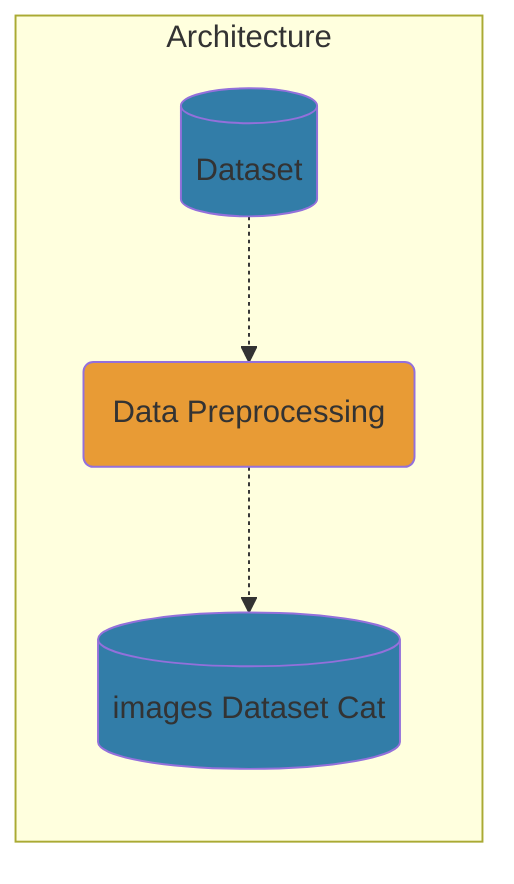

# Enhancing Logo Recognition and Similarity Search Through Synthetic Data Generation and Deep Learning Technique

## Chapter 1: Introduction

## Chapter 2: Literature Review

## Chapter 3: Research Design and Methodology

### 3.1 Architecture

 <b>Methodology Architecture</b>

### 3.2 Dataset
### 3.3 Data Preprocessing

## Chapter 4: Experiments and Results

## Chapter 5: Conclusion and Future Perspective